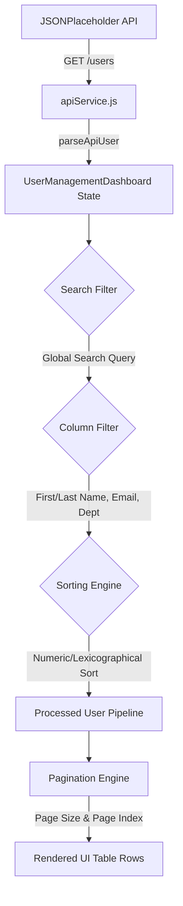

<div align="center">

# 📊 User Management Dashboard

[](https://react.dev/)
[](https://vitejs.dev/)
[](https://tailwindcss.com/)
[](https://vitest.dev/)
[](https://opensource.org/licenses/MIT)

**A high-performance, responsive single-page web application for user lifecycle management with full CRUD capabilities, client-side pagination, multi-column search & filtering, animated loading skeletons, and interactive state synchronization.**

[Live Demo](https://bhavanagangavaram.github.io/management-dashboard/) · [Report Bug](https://github.com/bhavanagangavaram/management-dashboard/issues) · [Request Feature](https://github.com/bhavanagangavaram/management-dashboard/issues)

</div>

---

## ⚡ Executive Summary

The **User Management Dashboard** is a enterprise-grade React 19 application designed for efficient user directory administration. Built with speed, accessibility, and modern design aesthetics in mind, it interfaces with the JSONPlaceholder REST API while executing real-time search indexing, multi-field column filtering, and numeric/lexicographical sorting entirely on the client side.

---

## ✨ Key Features

- **🔄 Full Lifecycle CRUD Operations** — Create, view, edit, and soft-delete user entries with real-time UI synchronization.
- **🔍 Multi-Field Instant Search** — Real-time search engine scanning across user ID, first name, last name, email, and department.
- **⚡ Advanced Column Filtering** — Multi-select criteria popup modal with active filter count badges and chip removal.
- **🔀 Smart Multi-Mode Sorting** — Toggleable ascending and descending column headers with numeric key preservation.
- **📄 Dynamic Pagination** — Configurable page sizes (10, 25, 50, 100) with bounds clamping and active item counters.
- **🔔 Toast Notification System** — Non-blocking, auto-dismissing success and error alerts with stacked layout.
- **💀 Loading Skeletons** — Smooth animated pulse placeholders while API data resolves.
- **♿ Accessibility Compliant** — Full keyboard navigation (Escape modal closing), ARIA attributes (`aria-sort`, `aria-label`), and contrast compliance.

---

## 📐 Architecture & Data Flow

The application follows a unidirectional data pipeline where raw API data passes through memoised transformation stages:



### Component Structure

```
src/
├── main.jsx                        # React entry point & root renderer
├── App.jsx                         # Shell wrapper component
├── index.css                       # Global styles & Tailwind directives
│
├── constants/
│   └── index.js                    # Base URLs, color maps, page sizes, column schemas
├── utils/
│   ├── helpers.js                  # Data parsing, formatting & hash generators
│   └── validation.js               # Form field validation rules & regex
├── services/
│   └── apiService.js               # Abstraction layer for HTTP REST requests
├── hooks/
│   └── useToast.js                 # Custom hook for toast notification state
│
├── components/
│   ├── Toast.jsx                   # Notification bar overlay
│   ├── UserAvatar.jsx              # Hash-colored initials avatar badge
│   ├── SortArrow.jsx               # Dynamic column direction indicator
│   ├── SkeletonRow.jsx             # Animated pulse loading placeholder
│   ├── Pagination.jsx              # Navigation controls & page size selector
│   ├── FilterModal.jsx             # Advanced multi-column filter modal
│   ├── UserFormModal.jsx           # User creation & edit modal dialog
│   └── DeleteModal.jsx             # Action confirmation modal dialog
│
└── pages/
    └── UserManagementDashboard.jsx # Core application state orchestrator
```

---

## 🛠️ Tech Stack & Dependencies

| Category | Technology | Version | Purpose |
| :--- | :--- | :--- | :--- |
| **Framework** | [React](https://react.dev/) | `v19.2` | Core UI Library with concurrent rendering |
| **Build Tool** | [Vite](https://vitejs.dev/) | `v8.1` | Ultra-fast HMR bundler and build engine |
| **Styling** | [TailwindCSS](https://tailwindcss.com/) | `v3.4` | Utility-first responsive design framework |
| **Testing** | [Vitest](https://vitest.dev/) | `v4.1` | Lightning fast unit testing framework |
| **DOM Testing** | [React Testing Library](https://testing-library.com/) | `v16.3` | User-centric UI testing utilities |
| **Linter** | [oxlint](https://oxc-project.github.io/) | `v1.69` | High performance JS/JSX linter |

---

## 🚀 Quick Start Guide

### Prerequisites

Ensure you have Node.js version 18+ and npm 9+ installed.

```bash
node -v # Should output >= 18.0.0
npm -v  # Should output >= 9.0.0
```

### Installation

1. **Clone the Repository**
   ```bash
   git clone https://github.com/bhavanagangavaram/management-dashboard.git
   cd management-dashboard
   ```

2. **Install Dependencies**
   ```bash
   npm install
   ```

3. **Start Development Server**
   ```bash
   npm run dev
   ```
   Open your browser and navigate to `http://localhost:5173`.

---

## 🧪 Testing & Code Quality

The codebase enforces strict unit testing coverage across services, utilities, and React components.

```bash
# Run all 67 Vitest unit tests
npm test

# Run tests in watch mode
npm run test:watch

# Execute oxlint code quality verification
npm run lint

# Create production build bundle
npm run build
```

### Test Suite Summary

- ✅ `helpers.test.js` — 13 tests passing
- ✅ `validation.test.js` — 15 tests passing
- ✅ `apiService.test.js` — 9 tests passing
- ✅ `Toast.test.jsx` — 5 tests passing
- ✅ `Pagination.test.jsx` — 7 tests passing
- ✅ `DeleteModal.test.jsx` — 5 tests passing
- ✅ `FilterModal.test.jsx` — 5 tests passing
- ✅ `UserFormModal.test.jsx` — 8 tests passing

---

## 🌐 API Integrations

The dashboard integrates with [JSONPlaceholder Mock REST API](https://jsonplaceholder.typicode.com):

| HTTP Method | Endpoint | Description |
| :--- | :--- | :--- |
| `GET` | `/users` | Retrieves initial list of seed user records |
| `POST` | `/users` | Simulates user creation & returns mock object |
| `PUT` | `/users/:id` | Simulates full update of user record |
| `DELETE` | `/users/:id` | Simulates user record deletion |

---

## 📄 License

Distributed under the MIT License. See `LICENSE` for more information.

---

<div align="center">
  Developed with ❤️ by <strong><a href="https://github.com/bhavanagangavaram">Bhavana Gangavaram</a></strong>
</div>
